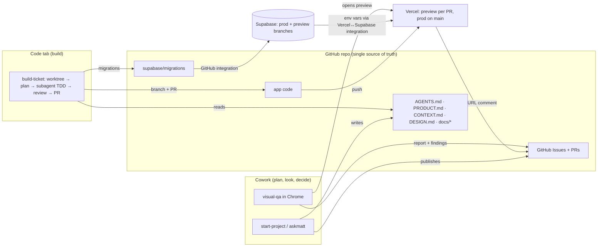

# Data-flow template

## Diagram (adapt names; keep it one screen)

## Artifact table

| Artifact | Source of truth | Written by | Read by | Moves via | Sync trigger | Drift guard |
|---|---|---|---|---|---|---|
| Product definition | `PRODUCT.md` | define-product | all agents, impeccable | git | commit | one product doc |
| Domain terms | `CONTEXT.md` | domain-modeling | all | git | on term resolved | glossary only |
| Architecture | `docs/tech.md`, `docs/adr/` | define-tech | build agent, reviewers | git | commit | ADR for hard choices |
| Toolchain | `docs/toolchain.md`, `.mcp.json`, `.claude/settings.json` | define-toolchain | all surfaces | git | tool change | re-run audit |
| Design system | `DESIGN.md` (+ `.impeccable/design.json`) | impeccable via define-design | build agent, visual-qa | git | approval | only impeccable writes it |
| Reference analyses | `docs/design/references/<name>/` | anydesign | define-design | git | on analysis | never in root |
| Spec / tickets | GitHub Issues (+ `docs/specs/`) | to-spec / to-tickets | build agent | GitHub | publish | one tracker |
| Code | `main` branch | build agent via PR | reviewers | GitHub | merge | branch protection + CI |
| DB schema | `supabase/migrations/` | build agent | Supabase GitHub integration | git → Supabase | PR / merge | no dashboard edits without `db pull` |
| Seed data | `supabase/seed.sql` | build agent | preview branches | git | branch create | realistic fakes |
| Env vars | Vercel project (values), `.env.example` (names) | Vercel↔Supabase integration, user | app | integration | PR open / install | synced names only |
| Preview URL | Vercel deployment | Vercel | visual-qa, user | PR comment/check | each push | login-protected |
| QA findings | `docs/qa/*` + PR comments | visual-qa | build agent | git / GitHub | per review | evidence required |
| Session log | `docs/log.md` | every session | next session | git | session end | ≤8 lines |
| Code graph (optional) | `graphify-out/` | Graphify | agents | local | commit hook | hint only |
| Vault (optional) | repo folder opened in Obsidian | user | user, agents | filesystem | live | never a copy |
